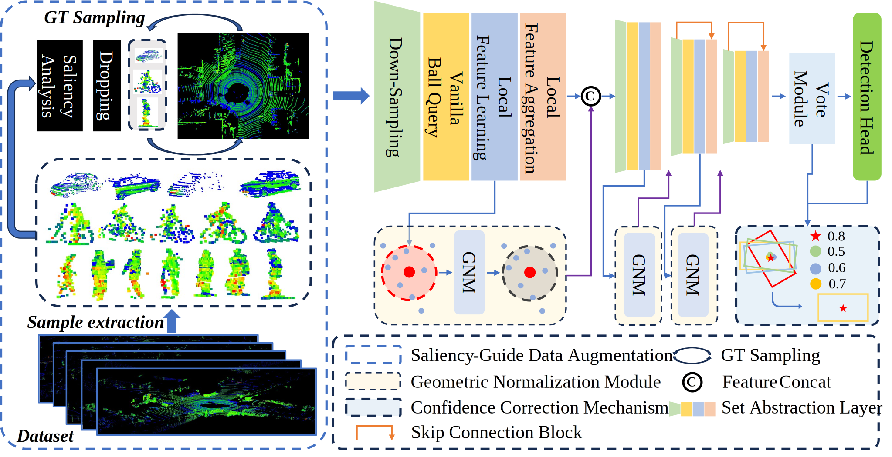
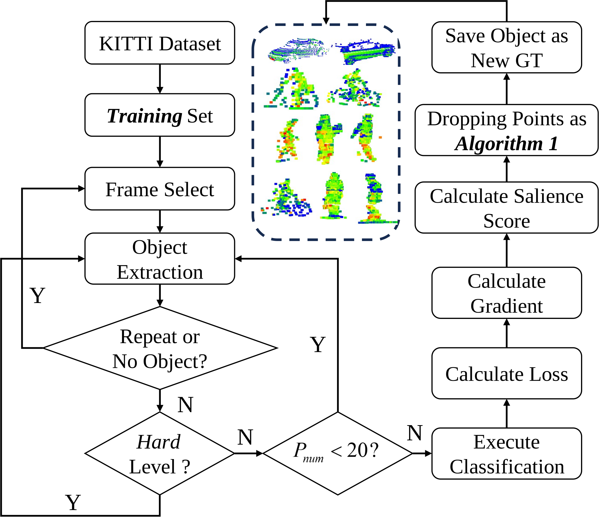
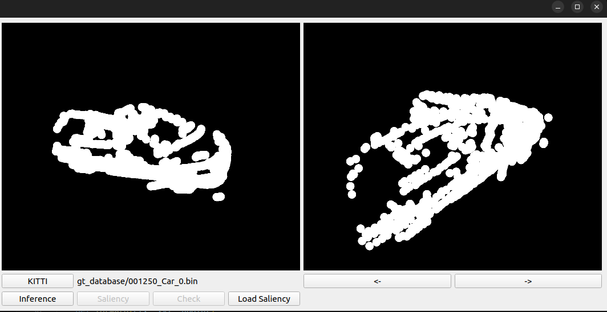
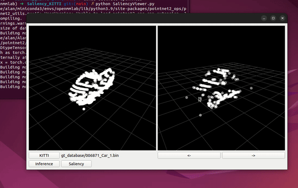

## Introduction

This if the official code of "SGCCNet: Single-Stage 3D Object Detector With Saliency-Guided Data Augmentation and Confidence Correction Mechanism"

The single-stage point-based 3D object detectors face challenges such as inadequate learning of low-quality objects (ILQ) and misalignment between localization accuracy and classification confidence (MLC). 

In this paper, we propose SGCCNet to alleviate these two issues. For ILQ, SGCCNet adopts a Saliency-Guided Data Augmentation (SGDA) strategy to enhance the robustness of the model on low-quality objects by reducing its reliance on salient features. For MLC, we design a Confidence Correction Mechanism (CCM) specifically for point-based multi-class detectors. This mechanism corrects the confidence of the current proposal by utilizing the predictions of other vote points within the local region in the post-processing stage. 





## News and Updates

[2024-10-28] [SGDA](https://github.com/AlanLiangC/SGCCNet) (`SGCCNet`) is released.


## Installation

This project has provided an environment setting file of conda, users can easily reproduce the environment by the following commands:

```shell
git clone https://github.com/AlanLiangC/SGCCNet
cd SGCCNet/models/pointnet2_ops_lib
python setup.py develop
```


## Getting Started

### Training classification model

- Data preparation

We have prepared the KITTI and Waymo datasets according to the latest version of the [mmdetection3D](https://github.com/open-mmlab/mmdetection3d) project. The core of classification training is to obtain the gt_sample folder containing the target instances and the corresponding .pkl files.

- KITTI

```
kitti
├── ImageSets
│   ├── test.txt
│   ├── train.txt
│   ├── trainval.txt
│   ├── val.txt
├── testing
│   ├── calib
│   ├── image_2
│   ├── velodyne
│   ├── velodyne_reduced
├── training
│   ├── calib
│   ├── image_2
│   ├── label_2
│   ├── velodyne
│   ├── velodyne_reduced
│   ├── planes (optional)
├── kitti_gt_database
│   ├── xxxxx.bin
├── kitti_infos_train.pkl
├── kitti_infos_val.pkl
├── kitti_dbinfos_train.pkl
├── kitti_infos_test.pkl
├── kitti_infos_trainval.pkl
```

- Waymo

```
mmdetection3d
├── mmdet3d
├── tools
├── configs
├── data
│   ├── waymo
│   │   ├── waymo_format
│   │   │   ├── training
│   │   │   ├── validation
│   │   │   ├── testing
│   │   │   ├── gt.bin
│   │   │   ├── cam_gt.bin
│   │   │   ├── fov_gt.bin
│   │   ├── kitti_format
│   │   │   ├── ImageSets
│   │   │   ├── training
│   │   │   │   ├── image_0
│   │   │   │   ├── image_1
│   │   │   │   ├── image_2
│   │   │   │   ├── image_3
│   │   │   │   ├── image_4
│   │   │   │   ├── velodyne
│   │   │   ├── testing
│   │   │   │   ├── (the same as training)
│   │   │   ├── waymo_gt_database
│   │   │   ├── waymo_infos_trainval.pkl
│   │   │   ├── waymo_infos_train.pkl
│   │   │   ├── waymo_infos_val.pkl
│   │   │   ├── waymo_infos_test.pkl
│   │   │   ├── waymo_dbinfos_train.pkl

```

The workflow of SGDA is :



- train classification task

`python main.py`

- Generate GT sampling pool

`python generate_data_pkl.py`

Replace the generated .pkl with the original .pkl generated by OpenPCD to facilitate the GT sample process during training.


## Visualization

We have designed a user interface (UI) to display the results generated by ***SGDA*** inference.

### Use

- open main window

`python SaliencyViewer.py`




- Inference

Click **Button: Inference**



<video width="640" height="480" controls>
  <source src="pics/Saliency.mp4" type="video/mp4">
  Your browser does not support the video tag.
</video>
